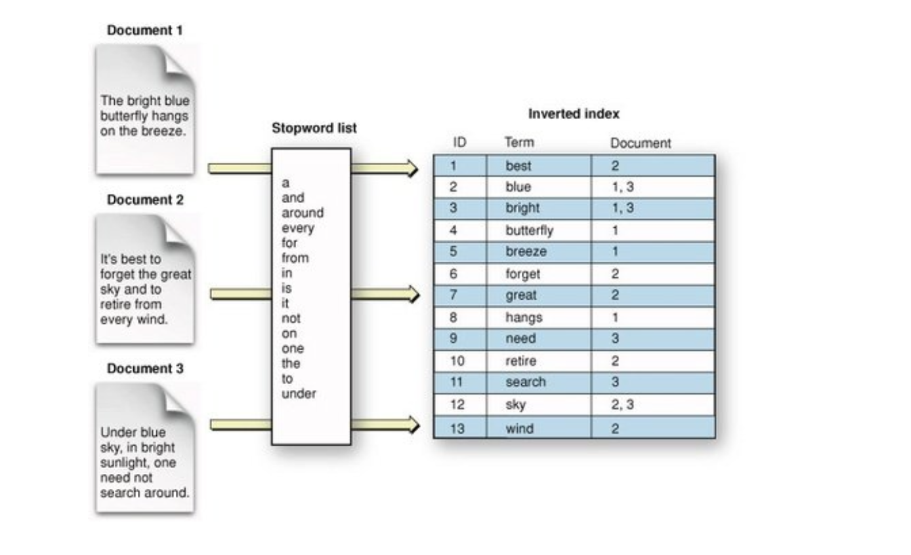

# Inverted Index Implementation



## Description
This project implements a parallelized inverted index using the **Map-Reduce** paradigm with **Pthreads**. The program processes a set of input files and builds an index listing all unique words along with the files they appear in.

## Implementation Details

### 1. Command-Line Arguments
The program takes the following command-line arguments:
```
./google-map-reduce <num_mappers> <num_reducers> <input_file>
```
- `<num_mappers>`: Number of mapper threads.
- `<num_reducers>`: Number of reducer threads.
- `<input_file>`: File containing the list of input text files.

### 2. File Processing
The input file is read, and the names of all text files to be processed are stored in a vector. These files are distributed evenly among the available mappers.

### 3. Thread Synchronization and Work Distribution
Files are allocated to mappers using the following calculation:
```
files_per_mapper = num_files / num_mappers
remaining_files = num_files % num_mappers
```
Each mapper is assigned a vector containing the indices of the files it will process.

## Parallel Execution

### **1. Mapper Threads**
Each mapper is responsible for processing the files assigned to it. This is done using a structure (`ThreadArgs`) that contains:
- The mapper's ID
- The list of assigned files
- Shared data structures
- Necessary mutexes

#### **Mapper Functionality**
- Converts the received argument to `ThreadArgs`
- Reads the assigned files, extracting words
- Stores words and file IDs in a local dictionary: `std::map<std::string, std::set<int>>`
- Uses mutexes to prevent race conditions when updating shared data
- Synchronizes with other mapper threads using a **barrier** to ensure all files are processed before moving to the reducer phase

### **2. Reducer Threads**
Each reducer processes a specific range of words based on the starting letter. It:
- Waits for all mappers to complete using a **barrier**
- Uses `ReducerArgs` structure containing:
  - The reducer's ID
  - The total number of reducers
  - A pointer to the shared data
- Processes only words that start with letters allocated to it
- Sorts words in **descending order by frequency**
- Writes the results into separate files (`a.txt`, `b.txt`, etc.), where each file contains words starting with a particular letter, formatted as:
  ```
  word: [file_id1 file_id2 ...]
  ```
- Uses mutexes to ensure safe access to shared data

### **Finalization**
Once all threads finish execution:
- All mapper and reducer threads are **joined**
- Allocated memory is **freed**

## Execution Example
Given an input file `test.txt`:
```
3
file1.txt
file2.txt
file3.txt
```
Run the program as:
```
google-map-reduce 3 2 test.txt
```
This runs the program with **3 mapper threads** and **2 reducer threads**.

## Output Format
The output consists of files `a.txt`, `b.txt`, etc., containing words sorted by frequency and then alphabetically if frequencies match.

## Requirements
- **C++**
- **Pthreads library**

## Compilation
```
make
```

## Run
```
google-map-reduce <num_mappers> <num_reducers> <input_file>
```

## Notes
- The implementation ensures **efficient load balancing** between threads.
- Proper **synchronization** is maintained using **mutexes** and **barriers**.
- The output is alphabetically structured for easy retrieval of indexed data.

